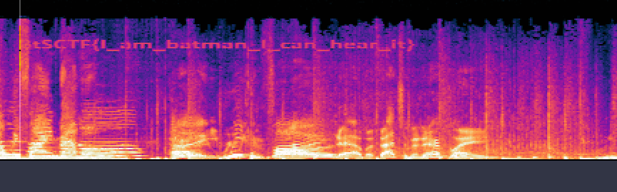
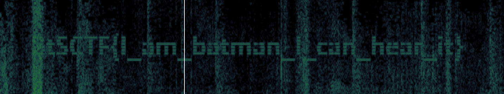

# Chiroptera Timida

| Titel          | Kategorie | flag | Difficulty |
| :---        |    :----   |:--- |  :--- |
| Chiroptera Timida | Forensics  | BtSCTF{I_am_batman_I_can_hear_it} | unknown |

## Description
Shall pass this childish brainrot and get the flag!

```
Bats are flippy, flappy cool, 
I love to learn about bats at school! 
Bats are flippy, flappy cool, 
I love to learn about bats at school! 
~~~~~~~~~~~~~🎵🎶~~~~~~~~~~~~~~~~
```

## Attachments
Bat_Song.wav

## Solution
I opened the file in Audacity and saw something that looked off on the lower lane in the spectrogram. I thought it might be a flag, so I tried to zoom in on it and see if I could make it out. At first I was not able to read all the letters, but I could see that it was a flag. 



I then tried to use Sonic Visualiser to see if I could get a better view of the flag.

After some tweaking, I was able to see the flag in the spectrogram more clearly.



The flag is: `BtSCTF{I_am_batman_I_can_hear_it}`