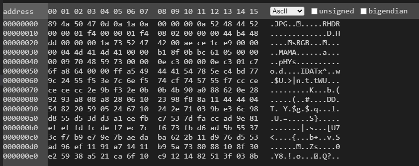
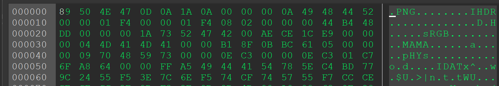
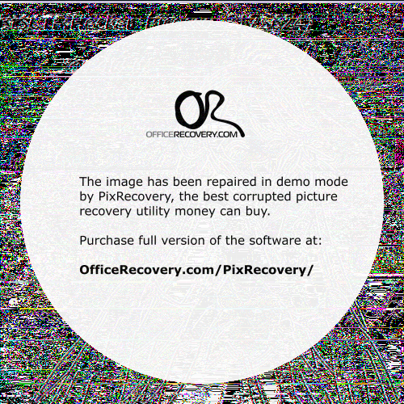
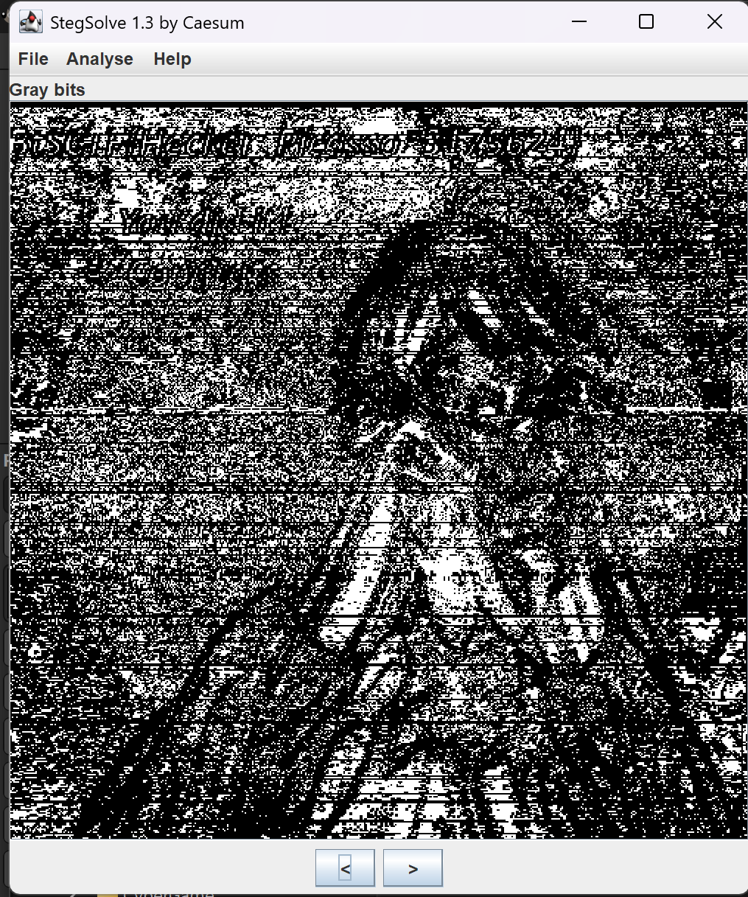

# Sus data

| Titel          | Kategorie | flag | Difficulty |
| :---        |    :----   |:--- |  :--- |
| Sus data | Forensics  | BtSCTF{Hecker_Picasso_3175624} | unknown |

## Description
We caught the suspect, but his pendrive contained only this data. What could it be?

## Attachments
Sus_data

## Solution

I first looked at the file with `strings`, `file` and `binwalk` to see if I could get any information about the file. The file did not contain any strings that would be useful, the type was data and in binwalk there was nothing to be found so nothing interesting there. I then tried to open the file in a hex editor and saw that the file had a familiar header:

As you can see the header is pretty close to that of a png file but kind of corrupted. I then tried fixing the header manually, but that did not work. I then tried to use various tools to fix the file, but none of them worked. After that I went on and tried various online tools to repair the png none of them worked either, except one. With `https://online.officerecovery.com/` I was able to produce a file that was not corrupted (and not just black with one white line). But not even that tool was able to get it from the original file, I had to adjust some parts of the header manually. This was the Header I used:

THis then produced the following png file:

So on the first glance it looks nothing special, just a lot of colorfull noise. But when looking through the Watermark I saw a Manga looking figure. So I figured i was on the right track. Then I saw on the left top side something that looked like a peace of text, really distorted and not really readable but I kind of was able to make out that it started with `BtS` and as this is the flag format I tried to read the text. I used `stegsolve` to see if I could get a better view of the text. The Gray bits view was the best one to kind of read the text:

I then was able to read the text and the flag was: `BtSCTF{Hecker_Picasso_3175624}`