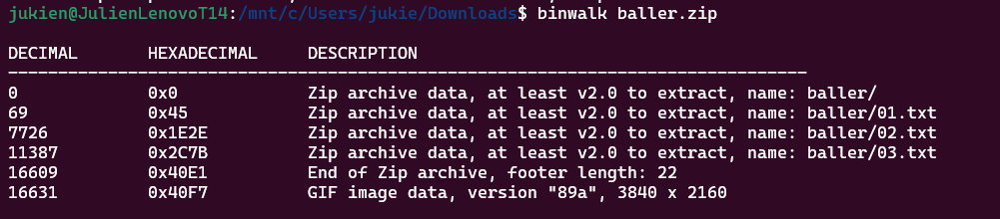

# Baller

| Titel          | Kategorie | flag | Difficulty |
| :---        |    :----   |:--- | :--- |
| Baller | Forensic  | CIT{im_balling_fr} | undefined |

## Description
Find the flag.

Flag Format: CIT{example_flag}

## Attachments
baller.zip

## Solution
First I tried to open the zip file with `WinRAR` but it was corrupted. The `file` command shows that the file is a:
```bash
baller.zip: Zip archive data, at least v2.0 to extract, compression method=store
```

So I tried to "repair" with the built-in repair function of `WinRAR` this seemed to work, the repaired zip contained 3 txt files. But the files just contained some Text about what CTF and Forensic CTF Challenges are.

With the `binwalk` command I could see that the archive also contained a GIF file:


So by extracting the GIF file with the `binwalk` command:
```bash
binwalk -e baller.zip
```

The extracte gif shows an image of a swimming duck and in the right corner on the bottom we can see the flag `im_balling_fr`:
