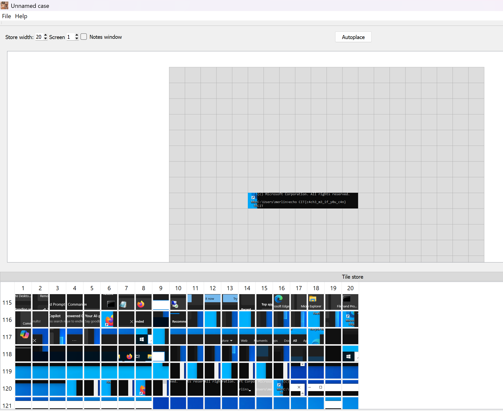

# Bits 'n Pieces

| Titel          | Kategorie | flag | Difficulty |
| :---        |    :----   |:--- | :--- | 
| Bits 'n Pieces | Forensic  | CIT{c4ch3_n3_if_y0u_c4n} | undefined |

## Description
Somewhere in these digital fragments lies what you've been searching for your entire lifetime, or really just this weekend ;)

## Attachments
Cache0000.bin

## Solution
In this challenge, we are given a file named `Cache0000.bin`. The file is a binary file. The `file` command shows that the file is a `data` file.

After some research, I found out that the file could be a RDP Bitmap Cache file. The RDP Bitmap Cache is a file format used by the Remote Desktop Protocol (RDP) to store bitmap images. The file contains a series of bitmap images that are used to display the remote desktop.

By using the [BMC Tools](https://github.com/ANSSI-FR/bmc-tools) we can extract the images from the file. The command to extract the images is:
```bash
python .\bmc-tools.py -s Cache0000.bin -d . -b
```
The output of the command is a series of bitmap images. There is also a collage.bmp file that contains all the images in a single file:


Now there are multiple ways to find the flag:
1) By looking at the images in the collage file, we can try to find the flag. Sometimes it can help to adjust the width of the collage in the bmc-tool (standard is 64). If your lucky the flag is already vissibile in the collage.
2) By using a program like this [RdpCacheStitcher](https://github.com/BSI-Bund/RdpCacheStitcher) to stich the images together manually or with the help of some AI.



The flag is in the image: `CIT{c4ch3_n3_if_y0u_c4n}`