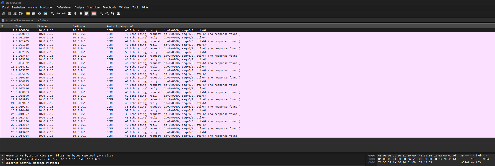
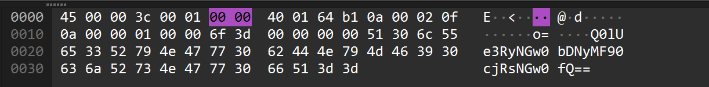

# Brainrot Quiz!

| Titel          | Kategorie | flag | Difficulty |
| :---        |    :----   |:--- | :--- |
| Brainrot Quiz! | Forensic  | CIT{tr4l4l3r0_tr4l4l4} | undefined |


## Description
Bombardiro Crocodillo or....? You find out...


## Solution
In this challenge, we are given a file named `brainrot.pcap`. In the file there are 30 ICMP packets.

attach the image (Screenshot_196.png) to the challenge




Packet 11 contains data that looks like a base64 encoded string. We can decode it using the following command:

```bash
 echo `echo Q0lUe3RyNGw0bDNyMF90cjRsNGw0fQ== | base64 --decode`
```
The output of the command is `CIT{tr4l4l3r0_tr4l4l4}`. This is the flag for the challenge.