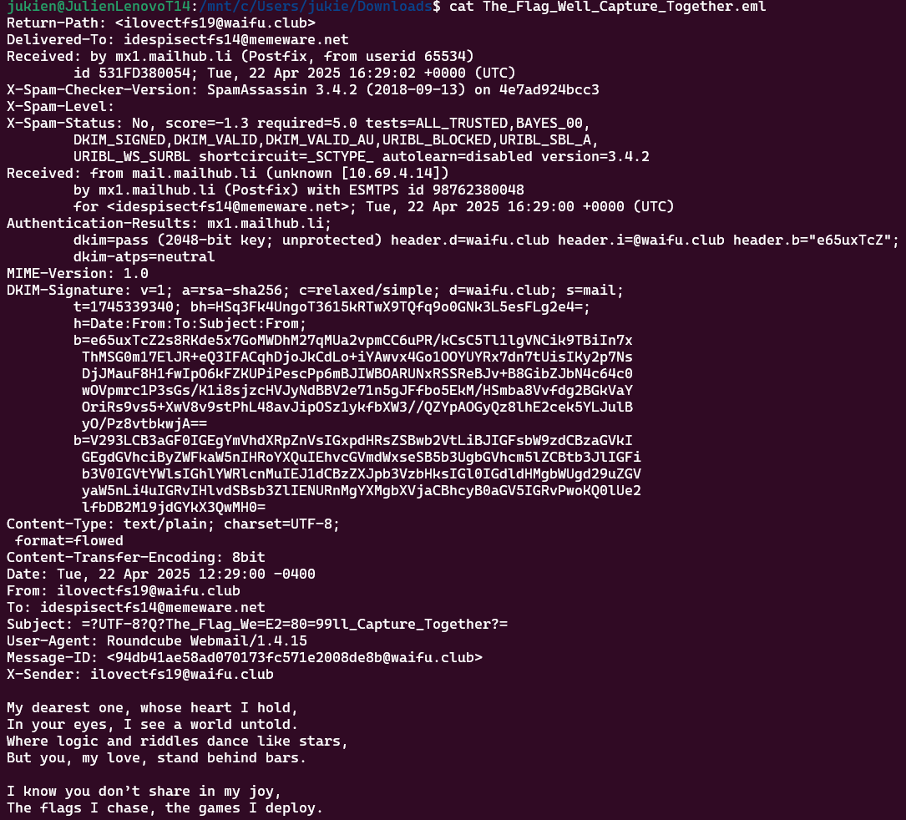

# True CTF Love

| Titel          | Kategorie | flag |
| :---        |    :----   |:--- |
| True CTF Love | Forensic  | CIT{i_l0v3_ctf$_t00} |

## Description
I got this strange email from another CTF participant not too long ago. I am just not sure what they mean by this...
Do you love CTFs as much as they do?

## Attachments
The_Flag_Well_Capture_Together.eml

## Solution
In this challenge, we are given an email file named `The_Flag_Well_Capture_Together.eml`. The email contains a Poem about CTFs. 



Checking with the `file` command, we can see that the file is:

```bash
The_Flag_Well_Capture_Together.eml: SMTP mail, Unicode text, UTF-8 text, with CRLF line terminators
```

Reading the file with `cat` command, we can see that the email contains hidden data in the form of a base64 encoded string. The string is located in the `DKIM-Signature` header of the email. The string is:
```
V293LCB3aGF0IGEgYmVhdXRpZnVsIGxpdHRsZSBwb2VtLiBJIGFsbW9zdCBzaGVkIGEgdGVhciByZWFkaW5nIHRoYXQuIEhvcGVmdWxseSB5b3UgbGVhcm5lZCBtb3JlIGFib3V0IGVtYWlsIGhlYWRlcnMuIEJ1dCBzZXJpb3VzbHksIGl0IGdldHMgbWUgd29uZGVyaW5nLi4uIGRvIHlvdSBsb3ZlIENURnMgYXMgbXVjaCBhcyB0aGV5IGRvPwoKQ0lUe2lfbDB2M19jdGYkX3QwMH0=
```

Decoded with the following command:

```bash
 echo `echo Q0lUe3RyNGw0bDNyMF90cjRsNGw0fQ== | base64 --decode`
```

the output is:

```
Wow, what a beautiful little poem. I almost shed a tear reading that. Hopefully you learned more about email headers. But seriously, it gets me wondering... do you love CTFs as much as they do?

CIT{i_l0v3_ctf$_t00}
```