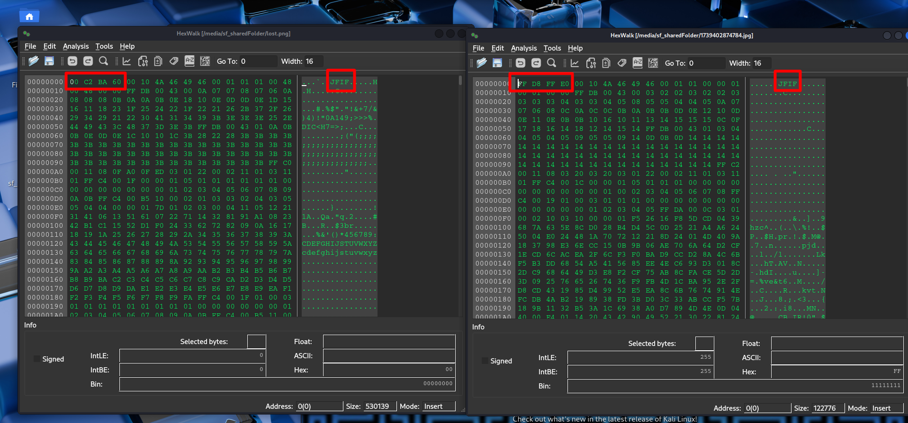
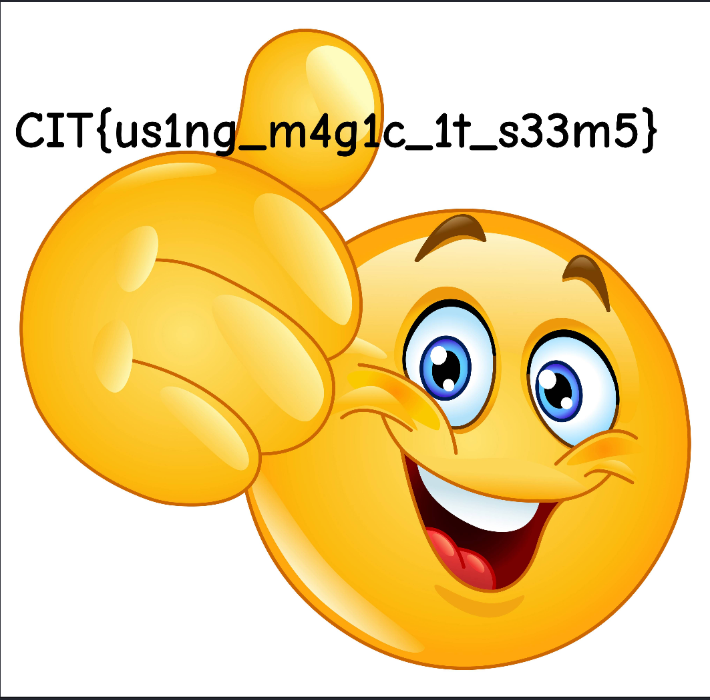

# We lost the flag

| Titel          | Kategorie | flag | Difficulty |
| :---        |    :----   |:--- | :--- |
| We lost the flag | Forensic  | CIT{us1ng_m4g1c_1t_s33m5} | undefined |

## Description
Sorry everyone, we unfortunately lost the flag for this challenge.

## Attachments
lost.png

## Solution
The Attached image was corrupted. The `file`command shows: lost.png: data.

When looking at the image woth the hexwalk viewer we can see the image has a JFIF header so its actually a JPEG image. So by opening an non corrupt JPEG image and comparing the first 8 byte are wrong. 

By fixing the first 8 bytes to `FFD8FFE0` we can open the image.

The flag is in the image: `CIT{us1ng_m4g1c_1t_s33m5}`