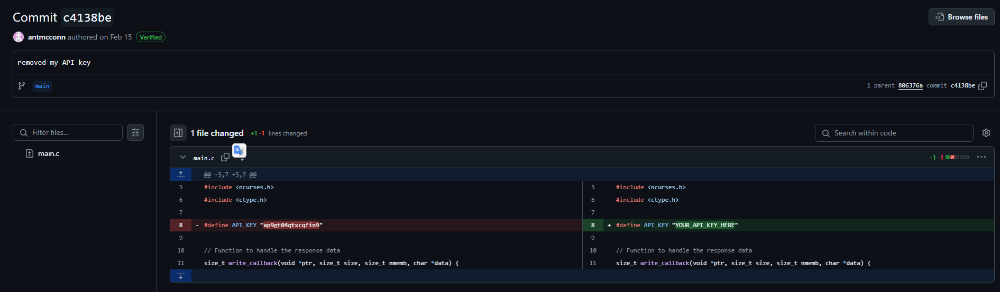

# No Country for Old Keys

| Titel          | Kategorie | flag | Difficulty |
| :---        |    :----   |:--- | :--- |
| No Country for Old Keys | OSINT  | ap9gt04qtxcqfin9 | undefined |

## Description
What is Anthony McConnolly's API key?

## Solution
By searching for the name `Anthony McConnolly` on `Github`, we can find a User with the name `Anthony McConnolly`.
[Anthony McConnolly](https://github.com/antmcconn)

He has a public repository named `ai-web-browser`. By checking the code inside the repository we can find that there is no API key in the code. But by checking the previous commits we can find a commit with the message `removed my API key`. By checking the commit we can find:

The API key/Flag is `ap9gt04qtxcqfin9`