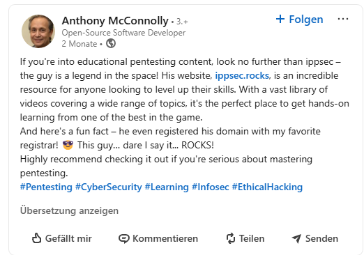
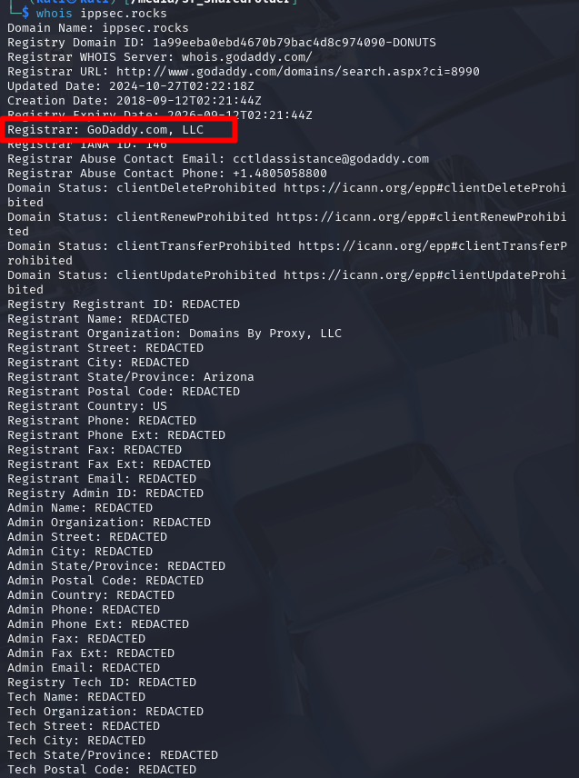

#The Domain Always Resolves Twice

| Titel          | Kategorie | flag |
| :---        |    :----   |:--- |
| The Domain Always Resolves Twice | OSINT  | GoDaddy |

## Description
What is Anthony McConnolly's favorite domain registrar?

## Solution
By searching for the name `Anthony McConnolly` on `Google`, we can eventually find LinkedIn profile of `Anthony McConnolly`.

[LinkedIn](https://www.linkedin.com/in/anthony-mcconnolly-b9110a351/)

By looking at his posts we can find the following post:

So then by checking `https://ippsec.rocks/` on a whois lookup we can find the registrar:
