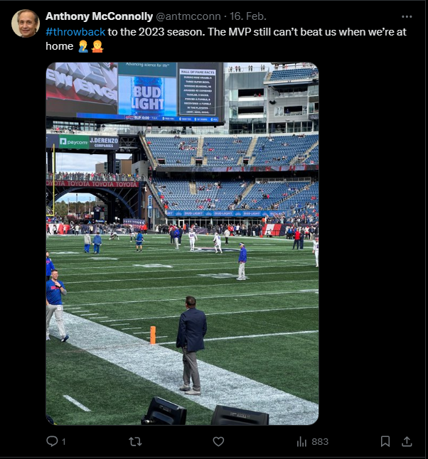
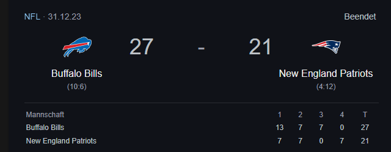

# Throwback to the Future

| Titel          | Kategorie | flag |
| :---        |    :----   |:--- |
| Throwback to the Future | OSINT  | 12/31/2023 |

## Description
What date was Anthony McConnolly's "throwback" photo taken? (not the day it was posted)

Format: MM/DD/YYYY

## Solution
By searching for the name `Anthony McConnolly` on `Google`, we actually can't find anything. But by searching for the name `Anthony McConnolly` on `X`, we can find a profile with the name `Anthony McConnolly`.

[X Profile](https://x.com/antmcconn)

By checking his posts we can find a post with the Hashtag `#throwback`:

By checking the image we can see that the footballgame was Buffalo Bills vs. New England Patriots. By searching for the game in 2023 we can find that the game was played on `December 31, 2023`. So the flag is `12/31/2023`.

