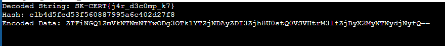

# ConnectionChecker - Lies

| Titel          | Kategorie | flag | Difficulty |
| :---        |    :----   |:--- |  :--- |
| ConnectionChecker - Lies | Malware Analysis and Reverse Engineering  | SK-CERT{k3y_f0r_c253rv3r} | easy (1 filled star) |

## Description
It turns out Bob wasn't lucky after all. This tool isn't a helpful diagnostic. Can you reveal its true purpose?

## Attachments
CheckConnection.jar
(Follow-up challenge to ConnectionChecker - Tool)

## Solution

Adjusted the code so it ignores the hash check and debuged the program. By looking at the 'encodedData' variable I was able to find the flag. When printing the variable I got a Base64 encoded string in the console:



By decoding the Base64 string I got the following output:

```
dfef15cf0e01909f75dd1647d0b993a3|SK-CERT{k3y_f0r_c253rv3r}
```

The flag is SK-CERT{k3y_f0r_c253rv3r}.