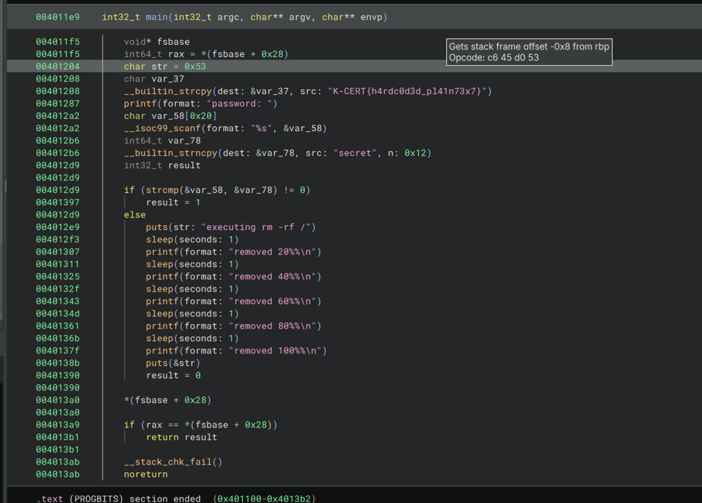

# SanityChecker - Password protected

| Titel          | Kategorie | flag | Difficulty |
| :---        |    :----   |:--- |  :--- |
| SanityChecker - Password protected | Malware Analysis and Reverse Engineering  | SK-CERT{h4rdc0d3d_pl41n73x7} | super easy (0 filled stars) |

## Description
EN: It appears that the bash script left another executable on your system. It also seems to be password-protected. I don't know the password, but I'm really curious about what secrets this file holds. The flag is in the format SK-CERT{...}. There are multiple ways to obtain the flag. For example, you can use static analysis of the binary to either read the flag from its data or find a hardcoded password. Alternatively, you can use dynamic analysis or binary patching.

## Attachments
1.py
(Follow-up challenge to SanityChecker - Sleepy python)

## Solution

Checked in Binary Ninja, the flag is hardcoded in the binary.

