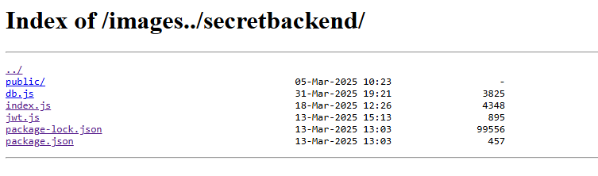

# Equestria - Door To The Stable

| Titel          | Kategorie | flag | Difficulty |
| :---        |    :----   |:--- |  :--- |
| Equestria - Door To The Stable | Web Exploitation and Binary Exploitation  | SK-CERT{0ff_by_4_s1ngle_sl4sh_f836a8b1} | medium |

## Description
We are suspecting that the website on http://exp.cybergame.sk:7000/ is hiding something. We need to find out what is hidden in the website. We've gathered what seems to be a proxy configuration file from our trusted source.

## Attachments
nginx.conf

```
events {
    worker_connections 1024;
}

http {
    include mime.types;

    server {
        listen 80;
        server_name localhost;

        root /app/src/html/;
        index index.html;


        location /images {
            alias /app/src/images/;
            autoindex on;
        }

        location /ponies/ {
            alias /app/src/ponies/;
        }

        location /resources/ {
            alias /app/src/resources/;
        }

        location /secretbackend/ {
            proxy_pass http://secretbackend:3000/;
            proxy_set_header Host $host;
            proxy_set_header X-Real-IP $remote_addr;
        }
    }
}
```

## Solution
After some investigation, I found that path traversal works on the website. So by using `/images../secretbackend/` I was able to access a list of Indexes of the secret backend.



After looking at the files I found inside the ìndex.js` file a string in Base64 format. It seems to be the req.headers.authorization that checks if the username and password together match the base64 encoding of this. By decoding the string I got the following output:
```
cHIxbmNlc3M6U0stQ0VSVHswZmZfYnlfNF9zMW5nbGVfc2w0c2hfZjgzNmE4YjF9
```

```
pr1ncess:SK-CERT{0ff_by_4_s1ngle_sl4sh_f836a8b1}
```
The flag is SK-CERT{0ff_by_4_s1ngle_sl4sh_f836a8b1}.