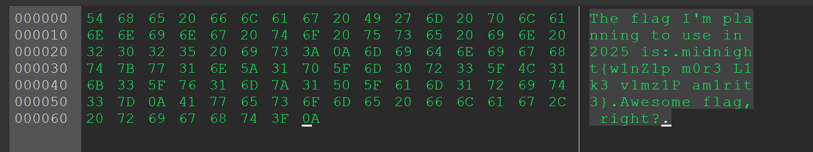

# Old Chall

| Titel          | Kategorie | flag | Difficulty |
| :---        |    :----   |:--- |  :--- |
| Old Chall | crypto  | midnight{w1nZ1p_m0r3_L1k3_v1mz1P_am1rit3} | unknown |

## Description
We postpwned the quals so much that this chall is straight from 2018.

## Attachments
ssh bionic@oldchall-wzmj3o9b.ctf.pro / Password: F33lOldY3t

## Solution
When connecting to the ssh server, I checked with `ls -la` and found the following structure:


I found a file called `flag.txt` and opened it with `cat flag.txt`. The content of the file was:

```bash
VimCrypt~01!▒p▒r
▒▒▒X▒▒0ؕԠ▒▒}▒wN▒▒yʮ▒~▒#V▒#ej▒▒>9𛹽▒▒t▒▒l▒;
▒sE▒3▒>▒c▒vo
```
This output tells us it is encrypted with vim. I then checked opened the file with `vim` then I was prompted for a password. As I didn't know this one yet I just pressed `enter` the file opened but the content was still encrypted. I then checked with `:set cm?` this produced:
```bash
cryptmethod=zip
```

I then checked the other files in the directory, there was one file that caught my attention, `.viminfo`. This file contains:
```bash
orga@bionic:~$ cat ~/.viminfo
# This viminfo file was generated by Vim 8.0.
# You may edit it if you're careful!

# Viminfo version
|1,4

# Value of 'encoding' when this file was written
*encoding=latin1


# hlsearch on (H) or off (h):
~h
# Last Substitute Search Pattern:
~MSle0~&\%$

# Last Substitute String:
$\rAwesome flag, right?

# Command Line History (newest to oldest):
:q
|2,0,1526733749,,"q"
:w flag.txt
|2,0,1526537645,,"w flag.txt"
:%s/\%$/\rAwesome flag, right?/
|2,0,1526537642,,"%s/\\%$/\\rAwesome flag, right?/"
:append
|2,0,1526537636,,"append"
:%s/^/The flag I'm planning to use in 2025 is:/
|2,0,1526537632,,"%s/^/The flag I'm planning to use in 2025 is:/"

# Search String History (newest to oldest):
? \%$
|2,1,1526537642,,"\\%$"
? ^
|2,1,1526537632,,"^"

# Expression History (newest to oldest):

# Input Line History (newest to oldest):

# Debug Line History (newest to oldest):

# Registers:

# File marks:
'0  1  60  ~/flag.txt
|4,48,1,60,1526733749,"~/flag.txt"
'1  1  0  ~/flag.txt
|4,49,1,0,1526733639,"~/flag.txt"
'2  1  60  ~/flag.txt
|4,50,1,60,1526733601,"~/flag.txt"
'3  1  60  ~/flag.txt
|4,51,1,60,1526733601,"~/flag.txt"
'4  3  0  ~/flag.txt
|4,52,3,0,1526537647,"~/flag.txt"
'5  3  0  ~/flag.txt
|4,53,3,0,1526537647,"~/flag.txt"
'6  3  0  ~/flag.txt
|4,54,3,0,1526537647,"~/flag.txt"
'7  3  0  ~/flag.txt
|4,55,3,0,1526537647,"~/flag.txt"
'8  3  0  ~/flag.txt
|4,56,3,0,1526537647,"~/flag.txt"
'9  3  0  ~/flag.txt
|4,57,3,0,1526537647,"~/flag.txt"

# Jumplist (newest first):
-'  1  60  ~/flag.txt
|4,39,1,60,1526733749,"~/flag.txt"
-'  1  0  ~/flag.txt
|4,39,1,0,1526733639,"~/flag.txt"
-'  1  60  ~/flag.txt
|4,39,1,60,1526733601,"~/flag.txt"
-'  3  0  ~/flag.txt
|4,39,3,0,1526537647,"~/flag.txt"
-'  3  0  ~/flag.txt
|4,39,3,0,1526537647,"~/flag.txt"
-'  3  0  ~/flag.txt
|4,39,3,0,1526537647,"~/flag.txt"
-'  3  0  ~/flag.txt
|4,39,3,0,1526537647,"~/flag.txt"
-'  2  0  ~/flag.txt
|4,39,2,0,1526537642,"~/flag.txt"
-'  2  0  ~/flag.txt
|4,39,2,0,1526537642,"~/flag.txt"
-'  2  0  ~/flag.txt
|4,39,2,0,1526537642,"~/flag.txt"
-'  2  0  ~/flag.txt
|4,39,2,0,1526537642,"~/flag.txt"
-'  1  0  ~/flag.txt
|4,39,1,0,1526537632,"~/flag.txt"

# History of marks within files (newest to oldest):

> ~/flag.txt
        *       1526733747      0
        "       1       60
```

So this file contains some plaintext that was written to the `flag.txt` file. The line `The flag I'm planning to use in 2025 is:` is interessting. 

I then copied the file to my local machine by converting the content of the file to base64 and then extracting this to my local machine.

First I tried to decrypt the file with `https://github.com/nlitsme/vimdecrypt` by using multiple wordlists and also just bruteforce but to no result.

After some research with the information that we have some plaintext and the hint from the description that this challenge is from 2018, it seems the encryption is vulnerable to `https://github.com/kimci86/bkcrack` so I installed it and ran it:

```bash 
./bkcrack.exe -c flag.txt -p plain.txt
bkcrack 1.7.1 - 2024-12-21
[12:25:22] Z reduction using 32 bytes of known plaintext
100.0 % (32 / 32)
[12:25:23] Attack on 240830 Z values at index 7
Keys: 09c07212 4db0ca87 bd26acc8
74.3 % (178953 / 240830)
Found a solution. Stopping.
You may resume the attack with the option: --continue-attack 178953
[12:27:10] Keys
09c07212 4db0ca87 bd26acc8
```
Then I put the Keys into the `bkcrack`:
```bash
./bkcrack.exe -c flag.txt -k 09c07212 4db0ca87 bd26acc8 -d out
bkcrack 1.7.1 - 2024-12-21
[12:28:23] Writing deciphered data out
Wrote deciphered data.
```

This then produced a file with the following content:



So the Flag is: `midnight{w1nZ1p_m0r3_L1k3_v1mz1P_am1rit3}`