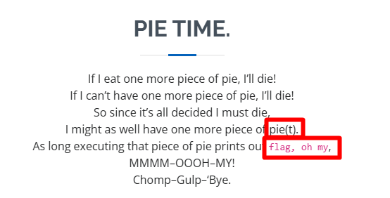
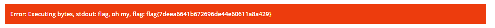

# I Want Pie

| Titel          | Kategorie | flag | Difficulty |
| :---        |    :----   |:--- |  :--- |
| I Want Pie | Miscellaneous  | flag{7deea6641b672696de44e60611a8a429}> | medium |

## Description
If I eat one more piece of pie, I'll die!
If I can't have one more piece of pie, I'll die!
So since it's all decided I must die,
I might as well have one more piece of pie.
As long executing that piece of pie prints out flag, oh my,
Chomp---Gump---'Bye.

## Attachments
Just a website:
```html
<html lang="en" data-lt-installed="true"><head>
  <meta charset="utf-8">
  <meta content="width=device-width, initial-scale=1.0" name="viewport">

  <title>Pie Time</title>
  <meta content="" name="description">
  <meta content="" name="keywords">

  <!-- Favicons -->
  <link href="assets/img/favicon.png" rel="icon">
  <link href="assets/img/apple-touch-icon.png" rel="apple-touch-icon">

  <!-- Google Fonts -->
  <link href="https://fonts.googleapis.com/css?family=Open+Sans:300,300i,400,400i,600,600i,700,700i|Raleway:300,300i,400,400i,500,500i,600,600i,700,700i|Poppins:300,300i,400,400i,500,500i,600,600i,700,700i" rel="stylesheet">

  <!-- Vendor CSS Files -->
  <link href="assets/vendor/aos/aos.css" rel="stylesheet">
  <link href="assets/vendor/bootstrap/css/bootstrap.min.css" rel="stylesheet">
  <link href="assets/vendor/bootstrap-icons/bootstrap-icons.css" rel="stylesheet">
  <link href="assets/vendor/boxicons/css/boxicons.min.css" rel="stylesheet">
  <link href="assets/vendor/glightbox/css/glightbox.min.css" rel="stylesheet">
  <link href="assets/vendor/swiper/swiper-bundle.min.css" rel="stylesheet">

  <!-- Template Main CSS File -->
  <link href="assets/css/style.css" rel="stylesheet">

<style>undefined</style></head>

<body data-aos-easing="ease-in-out" data-aos-duration="1000" data-aos-delay="0">

  <!-- ======= Mobile nav toggle button ======= -->
  <!-- <button type="button" class="mobile-nav-toggle d-xl-none"><i class="bi bi-list mobile-nav-toggle"></i></button> -->
  <i class="bi bi-list mobile-nav-toggle d-xl-none"></i>
  <!-- ======= Header ======= -->
  <header id="header" class="d-flex flex-column justify-content-center">

    <nav id="navbar" class="navbar nav-menu">
      <ul>
        <li><a href="#hero" class="nav-link scrollto"><i class="bx bx-home"></i> <span>Home</span></a></li>
        <li><a href="#facts" class="nav-link scrollto active"><i class="bx bx-book-content"></i> <span>About</span></a></li>
        <li><a href="#contact" class="nav-link scrollto"><i class="bx bx-envelope"></i> <span>Run it</span></a></li>
      </ul>
    </nav><!-- .nav-menu -->

  </header><!-- End Header -->

  <!-- ======= Hero Section ======= -->
  <section id="hero" class="d-flex flex-column justify-content-center">
    <div class="container aos-init aos-animate" data-aos="zoom-in" data-aos-delay="100">
      <h1>Pie Time</h1>
      <p>Mmmmm does my CPU ever like pie. And with the most colorful pie, we can...<span class="typed" data-typed-items="print ascii... probably">print </span><span class="typed-cursor" aria-hidden="true">|</span></p>
      <div class="social-links">
      </div>
    </div>
  </section><!-- End Hero -->

  <main id="main">

    <!-- ======= Facts Section ======= -->
    <section id="facts" class="facts">
      <div class="container aos-init aos-animate" data-aos="fade-up">

        <div class="section-title">
          <h2>Pie Time.</h2>
          <p>If I eat one more piece of pie, I’ll die!</p>
          <p>If I can’t have one more piece of pie, I’ll die!</p>
          <p>So since it’s all decided I must die,</p>
          <p>I might as well have one more piece of pie(t).</p>
          <p>As long executing that piece of pie prints out <code>flag, oh my</code>,</p>
          <p>MMMM–OOOH–MY!</p>
          <p>Chomp–Gulp–‘Bye.</p>
        </div>

        <div class="row">

          <div class="col-lg-3 col-md-6">
            <div class="count-box">
              <i class="bi bi-emoji-smile"></i>
              <span data-purecounter-start="0" data-purecounter-end="0" data-purecounter-duration="0" class="purecounter">0</span>
              <p>Happy Clients</p>
            </div>
          </div>

          <div class="col-lg-3 col-md-6 mt-5 mt-md-0">
            <div class="count-box">
              <i class="bi bi-journal-richtext"></i>
              <span data-purecounter-start="0" data-purecounter-end="1" data-purecounter-duration="0" class="purecounter">1</span>
              <p>Projects</p>
            </div>
          </div>

          <div class="col-lg-3 col-md-6 mt-5 mt-lg-0">
            <div class="count-box">
              <i class="bi bi-headset"></i>
              <span data-purecounter-start="0" data-purecounter-end="-1" data-purecounter-duration="0" class="purecounter">-1</span>
              <p>Hours Of Support</p>
            </div>
          </div>

          <div class="col-lg-3 col-md-6 mt-5 mt-lg-0">
            <div class="count-box">
              <i class="bi bi-award"></i>
              <span data-purecounter-start="0" data-purecounter-end="1540" data-purecounter-duration="0" class="purecounter">1.540</span>
              <h2>🤦</h2>
            </div>
          </div>

        </div>

      </div>
    </section><!-- End Facts Section -->
  
    <!-- ======= Run it Section ======= -->
    <section id="contact" class="contact">
      <div class="container aos-init aos-animate" data-aos="fade-up">

        <div class="section-title">
          <h2>Run it</h2>
        </div>

        <div class="row mt-1">

          
          <div class="">

            <form action="/run" method="post" role="form" class="php-email-form">
            
              <div class="form-group mt-3">
                  <input type="file" name="pie" accept="image/png">
              </div>
              <div class="my-3">
                <div class="loading">Loading</div>
                <div class="error-message"></div>
                <div class="sent-message">Your code is being processed! 👏</div>
              </div>
              <div class="text-center"><button type="submit">Pie Time!</button></div>
            </form>

          </div>

        </div>

      </div>
    </section><!-- End Contact Section -->

  </main><!-- End #main -->

  <!-- ======= Footer ======= -->
  <footer id="footer">
    <div class="container">
      <h3>Pie Time</h3>
      <p>With Pie(t) in hand, there's almost nothing that you can't do. Well... almost.</p>
      <div class="social-links">
      </div>
      <div class="copyright">
        © Copyright <strong><span>Pie Time</span></strong>. All Rights Reserved. Shel Silverstein's rights especially.
      </div>
      <div class="credits">
        <!-- All the links in the footer should remain intact. -->
        <!-- You can delete the links only if you purchased the pro version. -->
        <!-- Licensing information: [license-url] -->
        <!-- Purchase the pro version with working PHP/AJAX contact form: https://bootstrapmade.com/free-html-bootstrap-template-my-resume/ -->
        Designed by <a href="https://bootstrapmade.com/">BootstrapMade</a>
      </div>
    </div>
  </footer><!-- End Footer -->

  
  <a href="#" class="back-to-top d-flex align-items-center justify-content-center active"><i class="bi bi-arrow-up-short"></i></a>

  <!-- Vendor JS Files -->
  <script src="assets/vendor/purecounter/purecounter.js"></script>
  <script src="assets/vendor/aos/aos.js"></script>
  <script src="assets/vendor/bootstrap/js/bootstrap.bundle.min.js"></script>
  <script src="assets/vendor/glightbox/js/glightbox.min.js"></script>
  <script src="assets/vendor/isotope-layout/isotope.pkgd.min.js"></script>
  <script src="assets/vendor/swiper/swiper-bundle.min.js"></script>
  <script src="assets/vendor/typed.js/typed.min.js"></script>
  <script src="assets/vendor/waypoints/noframework.waypoints.js"></script>
  <script src="assets/vendor/php-email-form/validate.js"></script>

  <!-- Template Main JS File -->
  <script src="assets/js/main.js"></script><style type="text/css" data-typed-js-css="true">
        .typed-cursor{
          opacity: 1;
        }
        .typed-cursor.typed-cursor--blink{
          animation: typedjsBlink 0.7s infinite;
          -webkit-animation: typedjsBlink 0.7s infinite;
                  animation: typedjsBlink 0.7s infinite;
        }
        @keyframes typedjsBlink{
          50% { opacity: 0.0; }
        }
        @-webkit-keyframes typedjsBlink{
          0% { opacity: 1; }
          50% { opacity: 0.0; }
          100% { opacity: 1; }
        }
      </style>
</body></html>
```	
## Solution
After some careful reading of the poem and uploading a random PNG file (that produced the following error: `Error: This is prooobably not pie my CPU can eat. I like ppm pie.`). Also the text on the top of the website also gave me a hint:
`Mmmmm does my CPU ever like pie. And with the most colorful pie, we can...print ascii... probably|` so maybe we somehow have to print something. I then had the idea that maybe the website could expect a Piet image that prints the string `flag, oh my`.



*I marked the important parts of the poem in the screenshot above.*


I never heard of Piet before, but after a quick search I found out that Piet is an esoteric programming language in which programs are represented as abstract images. The language is named after the Dutch painter Piet Mondrian, whose works are characterized by a grid of colored rectangles.

I then tried studying the Piet language and tried to figure out how to write a Piet program. But after some time I found a github repository that could produce a Piet program that prints a customizable string:

https://github.com/sebbeobe/piet_message_generator

I then used the Piet Message Generator to create a Piet image that prints `flag, oh my` this then produced the following image:


I then uploaded the image to the website and it produced the following output:

```
Error: This is prooobably not pie my CPU can eat. I like ppm pie.
```

So then I opened the image in GIMP and exported it as a ppm file. I then uploaded the pmm file to the website and it produced the following output:



So the flag is: `flag{7deea6641b672696de44e60611a8a429}`