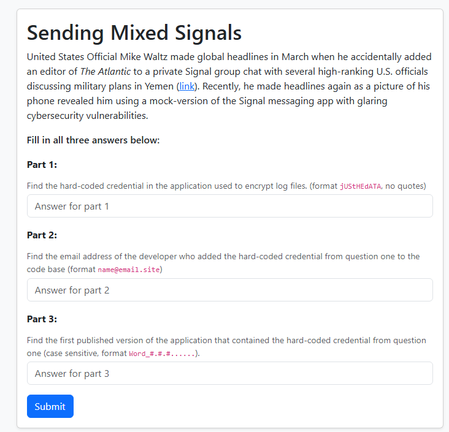
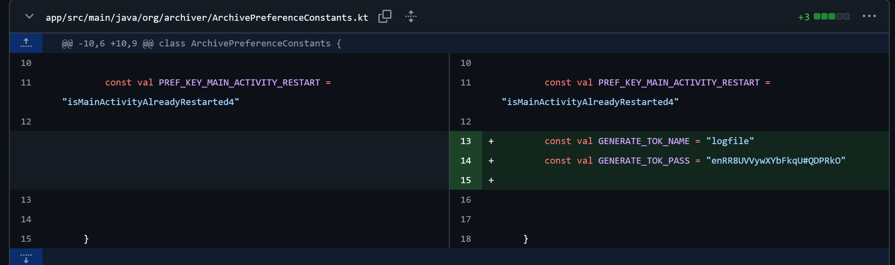
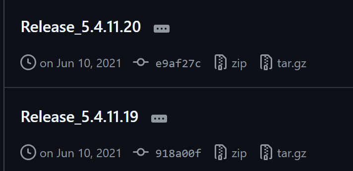
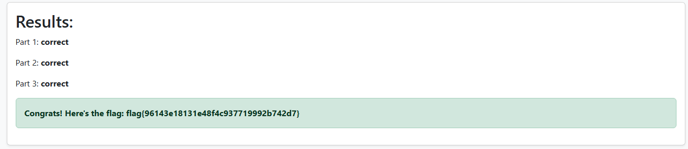

# Sending Mixed Signals

| Titel          | Kategorie | flag | Difficulty |
| :---        |    :----   |:--- |  :--- |
| Sending Mixed Signals | OSINT  | flag{96143e18131e48f4c937719992b742d7} | medium |

## Description
Turns out the Houthi PC Small Group was only the tip of the iceberg...

## Attachments
A website:

## Solution
I first started with some general google research on this mock-version of Signal. I found multiple Sources telling me the App was TeleMessage, so I started to do some research in that direction. I then found a Reddit Post titeled: `Here's the source code for the unofficial Signal app used by Trump officials, TeleMessage. The source code contains hardcoded credentials and other vulnerabilities.` and a link to this article: [Here's the source code for the unofficial Signal app used by Trump officials](https://micahflee.com/heres-the-source-code-for-the-unofficial-signal-app-used-by-trump-officials/).

After reading the article I rechecked the challenge website and realized that the Part 2 expects a Email address of the developer who hard-coded the credentials and in the article they mention three developer emails so I tried them and the first one worked: `moti@telemessage.com`.

I then went into the actual github repository of the app: [TeleMessage GitHub](https://github.com/micahflee/TM-SGNL-Android).

I first started looking around the code but at some point I realized that it might not be the fastest way to find the hard-coded credential by just looking around. As I already know which developer comitted the hard-coded credentials I decided to look through the commits of this developer. After some time I found this promising looking commit: [Log files + Updated version](https://github.com/micahflee/TM-SGNL-Android/commit/e9af27c382a86c3f2f666d479c1f7215ed18df9e)

And after looking at the changes I found the hard-coded credentials in the file `app/src/main/java/org/archiver/ArchivePreferenceConstants.kt`:

I then submitted the string `enRR8UVVywXYbFkqU#QDPRkO` to the challenge website and it told me that it was the correct answer. So now we have 2 out of 3 parts solved.

I looked at the last part of the challenge:
`Find the first published version of the application that contained the hard-coded credential from question one (case sensitive, format Word_#.#.#......).`

and realized I did myself a big favor by finding the commit where the hard-coded credentials were added and not just the file, because like this I now already know at what date the hard-coded credentials were added (`TELEMESSAGE\moti committed on Jun 10, 2021`). So I started looking through the Tags of the repository and when they were created and then I fount the following two tags:

I then tried both tags and the first one worked: `Release_5.4.11.20`.

This then printed the following:

So the flag is: `flag{96143e18131e48f4c937719992b742d7}`