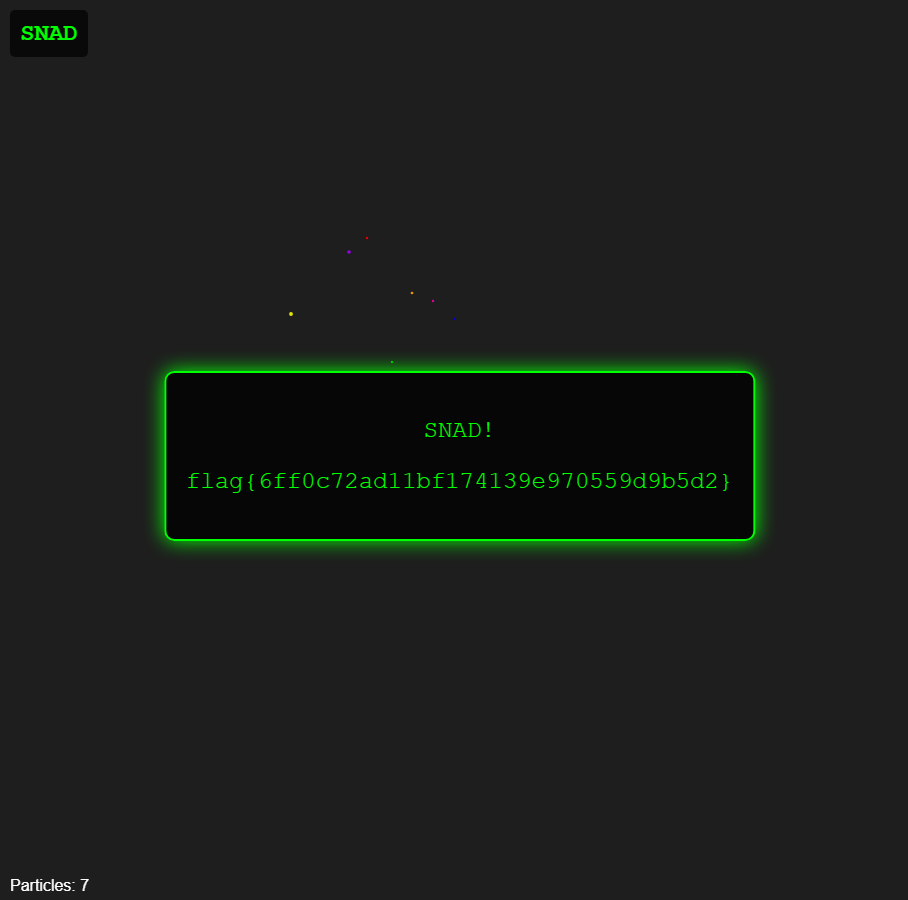

# SNAD

| Titel          | Kategorie | flag | Difficulty |
| :---        |    :----   |:--- |  :--- |
| SNAD | Web  | flag{6ff0c72ad11bf174139e970559d9b5d2} | easy |

## Description
No, it's not a typo. It's not sand. It's SNAD. There's a difference

## Attachments
Just a website:

```html
<html lang="en" data-lt-installed="true"><head>
    <meta charset="UTF-8">
    <meta name="viewport" content="width=device-width, initial-scale=1.0">
    <title>SNAD</title>
    <link rel="stylesheet" href="css/styles.css">
<style>undefined</style></head>

<body>
    <div class="controls">
        <h2 class="challenge-title">SNAD</h2>
    </div>

    <div id="flag-container" style="display: none;">
        <p>Loading...</p>
        <div class="loading"></div>
        <p id="flag-text"></p>
    </div>

    <script src="js/p5.min.js"></script>
    <script src="js/script.js"></script>


<main><canvas id="defaultCanvas0" class="p5Canvas" style="width: 919px; height: 911px;" width="919" height="911"></canvas></main></body></html>
```

## Solution
I checked out the `script.js` file and found the following code:

```javascript
const requiredGrains = 7
  , targetPositions = [{
    x: 367,
    y: 238,
    colorHue: 0
}, {
    x: 412,
    y: 293,
    colorHue: 40
}, {
    x: 291,
    y: 314,
    colorHue: 60
}, {
    x: 392,
    y: 362,
    colorHue: 120
}, {
    x: 454,
    y: 319,
    colorHue: 240
}, {
    x: 349,
    y: 252,
    colorHue: 280
}, {
    x: 433,
    y: 301,
    colorHue: 320
}]
  , tolerance = 15
  , hueTolerance = 20;
let particles = []
  , grid = []
  , isMousePressed = !1
  , colorIndex = 0
  , flagRevealed = !1
  , targetIndicatorsVisible = !1
  , gravityStopped = !1;
function getRainbowColor() {
    return color("hsb(" + (colorIndex = (colorIndex + 5) % 360) + ", 100%, 90%)")
}
function getSpecificColor(e) {
    return color("hsb(" + e + ", 100%, 90%)")
}
async function retrieveFlag() {
    let e = document.getElementById("flag-container");
    e.style.display = "block";
    try {
        let t = particles.filter(e => e.settled).map(e => ({
            x: Math.floor(e.x),
            y: Math.floor(e.y),
            colorHue: e.colorHue
        }))
          , o = await fetch("/api/verify-ctf-solution", {
            method: "POST",
            headers: {
                "Content-Type": "application/json"
            },
            body: JSON.stringify({
                particleData: t
            })
        })
          , i = await o.json()
          , r = e.querySelector(".loading");
        r && r.remove(),
        i.success ? (e.querySelector("p").textContent = "SNAD!",
        document.getElementById("flag-text").textContent = i.flag) : (e.querySelector("p").textContent = i.message,
        document.getElementById("flag-text").textContent = "",
        setTimeout( () => {
            e.style.display = "none",
            flagRevealed = !1
        }
        , 3e3))
    } catch (l) {
        console.error("Error retrieving flag:", l),
        document.getElementById("flag-text").textContent = "Error retrieving flag. Please try again.";
        let s = e.querySelector(".loading");
        s && s.remove()
    }
}
function injectSand(e, t, o) {
    if (isNaN(e) || isNaN(t) || isNaN(o))
        return console.error("Invalid parameters. Usage: injectSand(x, y, hue)"),
        !1;
    o = (o % 360 + 360) % 360;
    let i = new Particle(e,t,{
        colorHue: o,
        settled: !0,
        skipKeyCheck: !0,
        vx: 0,
        vy: 0
    });
    particles.push(i);
    let r = floor(e)
      , l = floor(t);
    return r >= 0 && r < width && l >= 0 && l < height && (grid[l][r] = !0),
    i
}
function toggleGravity() {
    gravityStopped = !gravityStopped,
    console.log(`Gravity ${gravityStopped ? "stopped" : "resumed"}`)
}
class Particle {
    constructor(e, t, o={}) {
        this.x = void 0 !== o.x ? o.x : e,
        this.y = void 0 !== o.y ? o.y : t,
        this.size = o.size || random(2, 4),
        void 0 !== o.colorHue ? (this.colorHue = o.colorHue,
        this.color = getSpecificColor(o.colorHue)) : (this.color = getRainbowColor(),
        this.colorHue = colorIndex),
        this.vx = void 0 !== o.vx ? o.vx : random(-.5, .5),
        this.vy = void 0 !== o.vy ? o.vy : random(0, 1),
        this.gravity = o.gravity || .2,
        this.friction = o.friction || .98,
        this.settled = o.settled || !1,
        o.skipKeyCheck || this.checkSpecialGrain()
    }
    checkSpecialGrain() {
        keyIsDown(82) ? (this.color = getSpecificColor(0),
        this.colorHue = 0) : keyIsDown(79) ? (this.color = getSpecificColor(40),
        this.colorHue = 40) : keyIsDown(89) ? (this.color = getSpecificColor(60),
        this.colorHue = 60) : keyIsDown(71) ? (this.color = getSpecificColor(120),
        this.colorHue = 120) : keyIsDown(66) ? (this.color = getSpecificColor(240),
        this.colorHue = 240) : keyIsDown(73) ? (this.color = getSpecificColor(280),
        this.colorHue = 280) : keyIsDown(86) && (this.color = getSpecificColor(320),
        this.colorHue = 320)
    }
    update(e) {
        if (this.settled || gravityStopped)
            return;
        this.vy += this.gravity,
        this.vx *= this.friction;
        let t = this.x + this.vx
          , o = this.y + this.vy;
        (t < 0 || t >= width || o >= height) && (o >= height && (o = height - 1,
        this.settled = !0),
        t < 0 && (t = 0),
        t >= width && (t = width - 1));
        let i = min(floor(o) + 1, height - 1)
          , r = floor(t);
        if (i < height && !e[i][r])
            this.x = t,
            this.y = o;
        else {
            let l = max(r - 1, 0)
              , s = min(r + 1, width - 1);
            i < height && !e[i][l] ? (this.x = t - 1,
            this.y = o,
            this.vx -= .1) : i < height && !e[i][s] ? (this.x = t + 1,
            this.y = o,
            this.vx += .1) : (this.x = r,
            this.y = floor(this.y),
            this.settled = !0)
        }
        let c = floor(this.x)
          , a = floor(this.y);
        c >= 0 && c < width && a >= 0 && a < height && (e[a][c] = !0)
    }
    draw() {
        noStroke(),
        fill(this.color),
        circle(this.x, this.y, this.size)
    }
}
function setup() {
    createCanvas(windowWidth, windowHeight),
    resetGrid(),
    document.addEventListener("keydown", function(e) {
        "t" === e.key && (targetIndicatorsVisible = !targetIndicatorsVisible),
        "x" === e.key && toggleGravity()
    }),
    window.injectSand = injectSand,
    window.toggleGravity = toggleGravity,
    window.particles = particles,
    window.targetPositions = targetPositions,
    window.checkFlag = checkFlag
}
function resetGrid() {
    grid = [];
    for (let e = 0; e < height; e++) {
        grid[e] = [];
        for (let t = 0; t < width; t++)
            grid[e][t] = !1
    }
    flagRevealed = !1;
    let o = document.getElementById("flag-container");
    o.style.display = "none"
}
function draw() {
    if (background(30),
    isMousePressed && mouseX > 0 && mouseX < width && mouseY > 0 && mouseY < height)
        for (let e = 0; e < 3; e++) {
            let t = new Particle(mouseX + random(-5, 5),mouseY + random(-5, 5));
            particles.push(t)
        }
    if (targetIndicatorsVisible)
        for (let o of (stroke(255, 150),
        strokeWeight(1),
        targetPositions))
            noFill(),
            stroke(o.colorHue, 100, 100),
            circle(o.x, o.y, 30);
    let i = [];
    for (let r = 0; r < height; r++) {
        i[r] = [];
        for (let l = 0; l < width; l++)
            i[r][l] = !1
    }
    for (let s of particles) {
        s.update(grid),
        s.draw();
        let c = floor(s.x)
          , a = floor(s.y);
        c >= 0 && c < width && a >= 0 && a < height && (i[a][c] = !0)
    }
    grid = i,
    checkFlag(),
    fill(255),
    textSize(16),
    text("Particles: " + particles.length, 10, height - 20)
}
function checkFlag() {
    if (flagRevealed)
        return;
    let e = 0
      , t = [];
    for (let o of targetPositions) {
        let i = !1;
        for (let r of particles)
            if (r.settled) {
                let l = dist(r.x, r.y, o.x, o.y)
                  , s = min(abs(r.colorHue - o.colorHue), 360 - abs(r.colorHue - o.colorHue));
                if (l < 15 && s < 20) {
                    i = !0,
                    t.push({
                        targetPos: `(${o.x}, ${o.y})`,
                        targetHue: o.colorHue,
                        particlePos: `(${Math.floor(r.x)}, ${Math.floor(r.y)})`,
                        particleHue: r.colorHue,
                        distance: Math.floor(l),
                        hueDifference: Math.floor(s)
                    });
                    break
                }
            }
        i && e++
    }
    e >= 7 && (flagRevealed = !0,
    console.log("\uD83C\uDF89 All positions correct! Retrieving flag..."),
    retrieveFlag())
}
function mousePressed() {
    isMousePressed = !0
}
function mouseReleased() {
    isMousePressed = !1
}
function keyPressed() {
    ("c" === key || "C" === key) && (particles = [],
    resetGrid())
}
function windowResized() {
    resizeCanvas(windowWidth, windowHeight),
    resetGrid()
}
```

I noticed that the game is about placing particles on specific target positions with specific colors. The goal is to place at least 7 particles correctly to reveal the flag.

I then realize I could just use the `injectSand` function to place the particles directly at the target positions with the correct colors. The target positions and their corresponding colors are defined in the `targetPositions` array.
I used the following commands in the browser console to inject the particles:

```javascript
injectSand(367, 238, 0);
injectSand(412, 293, 40);
injectSand(291, 314, 60);
injectSand(392, 362, 120);
injectSand(454, 319, 240);
injectSand(349, 252, 280);
injectSand(433, 301, 320);
```

After running these commands, the flag was revealed:

