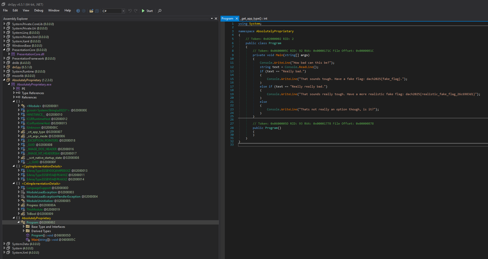

# absolutely-proprietary


| Titel          | Kategorie | flag | Difficulty |
| :---        |    :----   |:--- | :--- |
| absolutely-proprietary | RE  | dach2025{Y0u_c4n_run_c++_1n_d0tn3t?!_cad2e5de7c57} | medium |

## Description
**Diary Entry: February 03, 2080**
Two weeks have passed, and the nightmare deepens. Just when I thought maintaining a legacy software monstrosity was my biggest problem, my supervisor dropped a mysterious .exe file on my desk with a single note: "Analyze this."

## Attachments
absolutely-proprietary.tar.gz -> AbsolutelyProprietary.exe

## Solution

When running the .exe file it opens a Terminal and prints the following message:
```
How bad can this be?
```
    
Then it waits for user input. I tried to enter some random strings but the program just prints out the message:
```
Unfortunately, thats not an option. Try again.
Come on, how bad can this be?
```

Analyzing the file with `file` command shows that it is a PE32+ executable for Windows. It also shows that the file is a .NET assembly:
```bash
AbsolutelyProprietary.exe: PE32+ executable (console) x86-64 Mono/.Net assembly, for MS Windows, 7 sections
```

Checking with the `strings` command to check if maybe the flag is hidden in the strings of the file:
```bash
strings AbsolutelyProprietary.exe | grep -i dach2025{
```
but there is no flag in the strings.

Checking the file with `binwalk` command shows that the file isn't hidding any other files that may contain the flag:
```bash
DECIMAL       HEXADECIMAL     DESCRIPTION
--------------------------------------------------------------------------------
0             0x0             Microsoft executable, portable (PE)
16960         0x4240          Copyright string: "CopyrightAttribute"
29991         0x7527          Copyright string: "Copyright (c) 1337"
34032         0x84F0          PNG image, 256 x 256, 8-bit/color RGBA, non-interlaced
42976         0xA7E0          XML document, version: "1.0"
```

Because I know its a .NET assembly I can use the `dnSpy` tool to decompile the file. The `dnSpy` tool is a .NET debugger and assembly editor. It allows you to inspect and edit .NET assemblies.



Imediately when I open the file in `dnSpy` I can see that the file contains a class named `Program` and a method named `Main`.
```csharp
using System;

namespace AbsolutelyProprietary
{
	// Token: 0x02000002 RID: 2
	public class Program
	{
		// Token: 0x0600005C RID: 92 RVA: 0x0000171C File Offset: 0x00000B1C
		private void Main(string[] args)
		{
			Console.WriteLine("How bad can this be?");
			string text = Console.ReadLine();
			if (text == "Really bad.")
			{
				Console.WriteLine("That sounds tough. Have a fake flag: dach2025{fake_flag}.");
			}
			else if (text == "Really really bad.")
			{
				Console.WriteLine("That sounds really tough. Have a more realistic fake flag: dach2025{realistic_fake_flag_26c6983d1}");
			}
			else
			{
				Console.WriteLine("Thats not really an option though, is it?");
			}
		}

		// Token: 0x0600005D RID: 93 RVA: 0x00001778 File Offset: 0x00000B78
		public Program()
		{
		}
	}
}
```

When taking a closer look at the output strings that are written inside the Main method we can see this is actually not the method that is executed, it seems this is just a honeypot.

The real method is hidden somewhere else.

When checking out the `internal class <Module>` I found a method called `_get_app_type` it contained some byte arrays that look suspicious, it also contained Console.WriteLine and Console.ReadLine methods and what definitely made it interesting was that it printed the string `dach2025{}` char by char so it was not immediately visible.

```csharp
// <Module>
// Token: 0x06000001 RID: 1 RVA: 0x000010B0 File Offset: 0x000004B0
internal static int _get_app_type()
{
	byte[] array = new byte[]
	{
		80, 124, 126, 118, 51, 124, 125, 63, 51, 123,
		124, 100, 51, 113, 114, 119, 51, 112, 114, 125,
		51, 103, 123, 122, 96, 51, 113, 118, 44
	};
	int num = 0;
	if (0 < array.Length)
	{
		do
		{
			array[num] ^= 19;
			num++;
		}
		while (num < array.Length);
	}
	Console.WriteLine(Encoding.UTF8.GetString(array));
	string text = Console.ReadLine();
	byte[] array2 = new byte[]
	{
		125, 66, 68, 67, 23, 80, 94, 65, 82, 23,
		90, 82, 23, 86, 23, 69, 82, 86, 91, 23,
		81, 91, 86, 80, 23, 81, 88, 69, 23, 88,
		89, 84, 82, 25
	};
	int num2 = 0;
	if (0 < array2.Length)
	{
		do
		{
			array2[num2] ^= 55;
			num2++;
		}
		while (num2 < array2.Length);
	}
	int num3 = array2.Length;
	if (text.Length == num3 && text.GetHashCode() == Encoding.UTF8.GetString(array2).GetHashCode())
	{
		byte[] array3 = new byte[]
		{
			0, 45, 51, 40, 38, 41, 53, 109, 97, 50,
			40, 47, 34, 36, 97, 56, 46, 52, 97, 32,
			50, 42, 36, 37, 97, 50, 46, 97, 47, 40,
			34, 36, 45, 56, 111, 111, 111
		};
		int num4 = 0;
		if (0 < array3.Length)
		{
			do
			{
				array3[num4] ^= 65;
				num4++;
			}
			while (num4 < array3.Length);
		}
		Console.WriteLine(Encoding.UTF8.GetString(array3));
		Console.Write('d');
		Console.Write('a');
		Console.Write('c');
		Console.Write('h');
		Console.Write(20);
		Console.Write(25);
		Console.Write('{');
		byte[] array4 = new byte[]
		{
			168, 193, 132, 174, 146, 197, 159, 174, 131, 132,
			159, 174, 146, 218, 218, 174, 192, 159, 174, 149,
			193, 133, 159, 194, 133, 206, 208, 174, 146, 144,
			149, 195, 148, 196, 149, 148, 198, 146, 196, 198
		};
		int num5 = 0;
		if (0 < array4.Length)
		{
			do
			{
				array4[num5] ^= 241;
				num5++;
			}
			while (num5 < array4.Length);
		}
		Console.Write(Encoding.UTF8.GetString(array4));
		Console.Write('}');
		Console.WriteLine();
	}
	else
	{
		byte[] array5 = new byte[]
		{
			20, 47, 39, 46, 51, 53, 52, 47, 32, 53,
			36, 45, 56, 109, 97, 53, 41, 32, 53, 50,
			97, 47, 46, 53, 97, 32, 47, 97, 46, 49,
			53, 40, 46, 47, 111, 97, 21, 51, 56, 97,
			32, 38, 32, 40, 47, 111
		};
		int num6 = 0;
		if (0 < array5.Length)
		{
			do
			{
				array5[num6] ^= 65;
				num6++;
			}
			while (num6 < array5.Length);
		}
		Console.WriteLine(Encoding.UTF8.GetString(array5));
		<Module>._get_app_type();
	}
	return 0;
}
```

The arrays seem to be XOR encoded so I wrote a small script to decode the arrays and print the flag.

```python
# The code below is a simple XOR decoder that takes an array of integers and a key,
def decode_array(array, xor_key, label):
    decoded = ''.join(chr(b ^ xor_key) for b in array)
    print(f"{label}: {decoded}")


def main():
    # probably the standard output (Come on, how bad can this be?)
    decode_array([
        80, 124, 126, 118, 51, 124, 125, 63, 51, 123,
        124, 100, 51, 113, 114, 119, 51, 112, 114, 125,
        51, 103, 123, 122, 96, 51, 113, 118, 44
    ], 19, "array")

    # probably the password
    decode_array([
        125, 66, 68, 67, 23, 80, 94, 65, 82, 23,
        90, 82, 23, 86, 23, 69, 82, 86, 91, 23,
        81, 91, 86, 80, 23, 81, 88, 69, 23, 88,
        89, 84, 82, 25
    ], 55, "array2")

    # probably answer before the flag is printed
    decode_array([
        0, 45, 51, 40, 38, 41, 53, 109, 97, 50,
        40, 47, 34, 36, 97, 56, 46, 52, 97, 32,
        50, 42, 36, 37, 97, 50, 46, 97, 47, 40,
        34, 36, 45, 56, 111, 111, 111
    ], 65, "array3")

    # probably the flag (it prints dach2025{ before and } after this array
    decode_array([
        168, 193, 132, 174, 146, 197, 159, 174, 131, 132,
        159, 174, 146, 218, 218, 174, 192, 159, 174, 149,
        193, 133, 159, 194, 133, 206, 208, 174, 146, 144,
        149, 195, 148, 196, 149, 148, 198, 146, 196, 198
    ], 241, "array4")

    # probably the standard response (Unfortunately, thats not an option. Try again.)
    decode_array([
        20, 47, 39, 46, 51, 53, 52, 47, 32, 53,
        36, 45, 56, 109, 97, 53, 41, 32, 53, 50,
        97, 47, 46, 53, 97, 32, 47, 97, 46, 49,
        53, 40, 46, 47, 111, 97, 21, 51, 56, 97,
        32, 38, 32, 40, 47, 111
    ], 65, "array5")
```
When running the script we get the following output:
```
array: Come on, how bad can this be?
array2: Just give me a real flag for once.
array3: Alright, since you asked so nicely...
array4: Y0u_c4n_run_c++_1n_d0tn3t?!_cad2e5de7c57
array5: Unfortunately, thats not an option. Try again.
```
The flag is `dach2025{Y0u_c4n_run_c++_1n_d0tn3t?!_cad2e5de7c57}`.